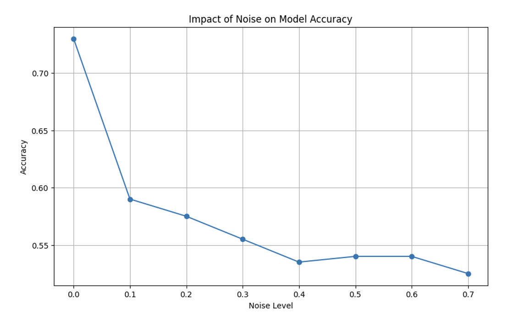
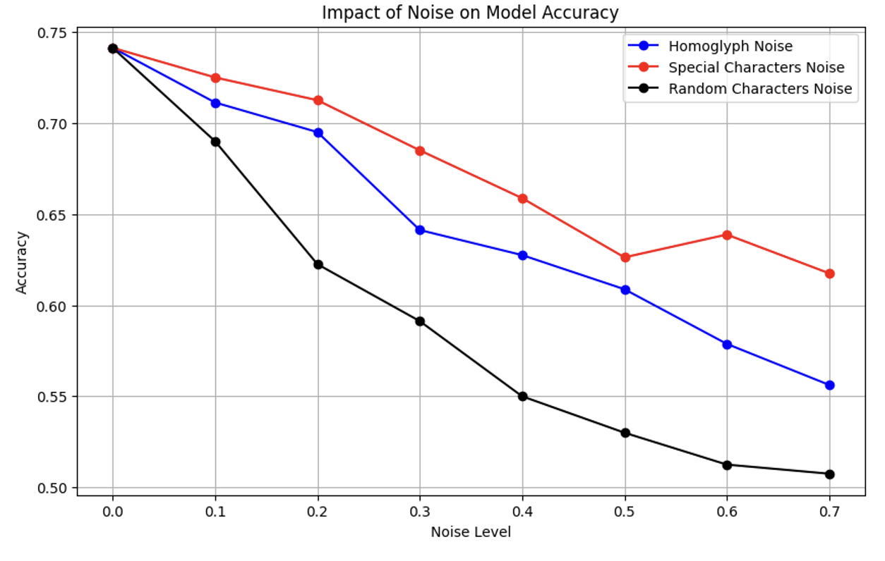

# Textual-Noise-effect-on-sentiment-Detection-Project
Analysis Impact of textual Noise on sentiment Detection Using LLMs

<strong>Original Text: Example text to be modified. </strong>

Noisy Text with Random Characters: Vxample tTxt to be modified. 

Noisy Text with Special Characters: EвĤxample text to be ŧmΐodiĆfied. 

Noisy Text with Homoglyphs: ᴇхạмpӏe text тo be mɵdifіeԁ.

 
  
<strong> Bertweet Accuracy with different noise rate and types of noise : </strong>
 
   

 
  
<strong>Distilled Bert without fine-tune Accuracy with different noise rate  : </strong>
 
   

The project investigates the impact of various types of textual noise on sentiment detection using bertbase pre-trained model and The three types of noise considered are: 1-Adding special characters to the text. 2 - Randomly changing characters in the text. 3-Replacing characters with similar-looking characters (homoglyphs). Adding special characters to text has the least impact on model accuracy. The model can recover the meaning of the words to a good extent, depending on the noise level. Replacing characters with similar-looking ones falls between the other two types in terms of impact on accuracy. While the meaning of words can often be recovered, it is less effective than dealing with special characters noise but more effective than random characters noise.
